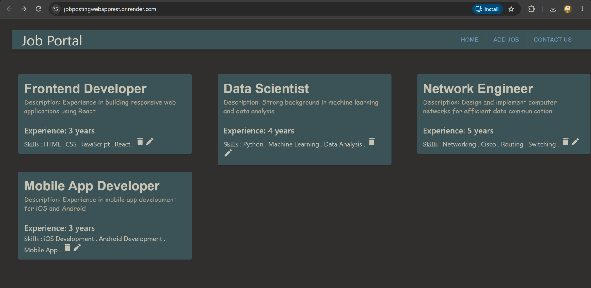

# Job Portal – Full-Stack CRUD App (Spring Boot + React)

A small job board where companies can **publish, browse, edit and delete job postings**.
The backend is a REST API built with **Spring Boot** and **Spring Data JPA**, storing the jobs in **PostgreSQL**;
the frontend is a **React** single-page app.
The whole app is packaged in **one Docker image** and deployed on **Render**, together with a Render PostgreSQL database.

[](https://jobpostingwebapprest.onrender.com/)
> Free hosting: the first request after ~15 min of inactivity can take up to a minute while the server wakes up.



---


## From an in-memory list to JPA + PostgreSQL

The first version kept the jobs in an `ArrayList` inside `JobRepo`, so every restart lost all changes.
The data layer now uses **Spring Data JPA** (Hibernate) with **PostgreSQL**:

| | Before (in-memory) | Now (JPA)                                                                     |
|---|---|-------------------------------------------------------------------------------|
| `JobRepo` | class with an `ArrayList` and hand-written CRUD methods | interface extending `JpaRepository<JobPost, Integer>` (CRUD methods included) |
| `JobPost` | plain POJO | `@Entity` with `@Id postId`                                                   |
| Data lifetime | lost on restart | stored in the database                                                        |
| Next ID | `stream().max()` over the whole list | `SELECT COALESCE(MAX(j.postId), 0)` query, only one number comes back         |

- `spring.jpa.hibernate.ddl-auto=update` lets Hibernate **create/update the table** from the entity, no SQL scripts needed.
- `spring.jpa.show-sql=true` prints the generated SQL in the console.
- The next ID is computed in the database with a custom JPQL query:

```java
@Query("SELECT COALESCE(MAX(job.postId), 0) FROM JobPost job")
int findMaxPostId();
```

`MAX` returns `NULL` on an empty table; `COALESCE(..., 0)` turns it into `0`, so the first job gets ID `1`.

### Demo data reset

To keep dataset clean, the sample jobs are restored at startup at specific interval (`DemoDataReset`):

```java
@EventListener(ApplicationReadyEvent.class) // when the app starts
@Scheduled(cron = "0 0 * * * *")            // minute 0 of every hour
public void reset() {
    jobService.resetDemoData();
}
```

- `@EnableScheduling` on the main class activates `@Scheduled`.
- `resetDemoData()` runs `deleteAll()`, then `flush()` and finally `load()` inside one `@Transactional` method, so the delete and
  the re-insert succeed or fail together and visitors never see an empty list.
- `flush()` sends the `DELETE`s to the database before re-inserting the same IDs (1-5); otherwise Hibernate still
  has those IDs marked as "deleted" in memory and throws an error.

## Features

- View all job postings (profile, description, experience, tech stack)
- Create a new posting — the ID is **assigned automatically** by the backend
- Edit an existing posting (fields and skills are pre-filled)
- Delete a posting
- Choose the required skills with checkboxes

## Tech stack

| Layer    | Technology |
|----------|------------|
| Backend  | Java 21, Spring Boot (Web MVC), Spring Data JPA / Hibernate, Lombok, Jackson (JSON + XML) |
| Database | PostgreSQL |
| Frontend | React 18, React Router, Axios, Material UI |
| DevOps   | Docker (multi-stage build), Render (web service + PostgreSQL), GitHub |

## Architecture

```
Browser -> React SPA (HTTP / JSON) -> Spring Boot REST API -> JobService -> JobRepo (JPA) -> PostgreSQL
```

In production, the React build is served by Spring Boot itself, so frontend and API share the same URL.

> **Note:** data is stored in PostgreSQL. On the live demo it is reset to the 5 sample jobs
> at startup and every hour (see [Demo data reset](#demo-data-reset)).

## REST API 

Endpoint can be tested with Postman.

| Method | Endpoint          | Description                         | Body       |
|--------|-------------------|-------------------------------------|------------|
| GET    | `/jobPosts`       | Get all job postings                | –          |
| GET    | `/jobPost/{id}`   | Get one job posting by ID           | –          |
| POST   | `/jobPost`        | Create a job posting (ID generated) | `JobPost`  |
| PUT    | `/jobPost`        | Update an existing job posting      | `JobPost`  |
| DELETE | `/jobPost/{id}`   | Delete a job posting                | –          |
| GET    | `/load`           | Insert/restore the 5 sample jobs    | –          |

Example `JobPost`:

```json
{
  "postId": 1,
  "postProfile": "Java Developer",
  "postDesc": "Must have good experience in core Java and advanced Java",
  "reqExperience": 2,
  "postTechStack": ["Core Java", "J2EE", "Spring Boot", "Hibernate"]
}
```

## Run locally

**Requirements:** Java 21, Node.js 20+ (or just Docker), and a running **PostgreSQL**.

### Database

Create a local database (e.g. with pgAdmin or `psql`):

```sql
CREATE DATABASE demo;
```

The connection is read from environment variables, with local defaults after the `:`:

```properties
spring.datasource.url=${DB_URL:jdbc:postgresql://localhost:5432/demo}
spring.datasource.username=${DB_USERNAME:postgres}
spring.datasource.password=${DB_PASSWORD:password}
```

If your local user/password are different, set `DB_USERNAME` / `DB_PASSWORD`
(e.g. in the IntelliJ Run Configuration) instead of editing the file.
The table is created automatically on the first start.

### Option A – Docker (same as production)

```bash
docker build -t jobapp .
docker run -p 8080:8080 -e DB_URL=jdbc:postgresql://host.docker.internal:5432/demo jobapp
```

Inside the container `localhost` is the container itself, so the local database is reached through
`host.docker.internal` (Docker Desktop).

Open http://localhost:8080

### Option B – Backend and frontend separately (for development)

```bash
# 1. Backend (from the project root)
./mvnw spring-boot:run          # Windows: mvnw.cmd spring-boot:run
# API available at http://localhost:8080/jobPosts

# 2. Frontend (in a second terminal)
cd CRUD-UI
npm install
npm start
# App available at http://localhost:3000 (API calls are proxied to port 8080)
```

## Deployment

1. The `Dockerfile` builds the React app, copies it into Spring Boot's `static` folder,
   builds the Spring Boot `.war`, and runs it with Java 21.
2. Render builds the Docker image from this GitHub repo and redeploys on every push to `main`.
3. The server port is read from Render's `PORT` variable (`server.port=${PORT:8080}`).

### Database on Render

1. In Render: **New / PostgreSQL**, in the **same region** as the web service
   (the internal hostname only works inside one region).
2. In the **web service** / **Environment**, add the connection values from the database page:

| Key | Value |
|---|---|
| `DB_URL` | `jdbc:postgresql://<internal-hostname>:5432/<database>` |
| `DB_USERNAME` | database username |
| `DB_PASSWORD` | database password |

3. **Manual Deploy / Deploy latest commit**. Hibernate creates the table and `DemoDataReset` inserts the sample jobs.

**Credentials are never committed**: the code only contains `${DB_PASSWORD}`; the real values live in
Render's environment variables. The database's inbound IP rule `0.0.0.0/0` can be removed, because the app
connects through Render's internal network.

### Troubleshooting

| Log message | Cause / fix |
|---|---|
| `Connection to localhost:5432 refused` | no `DB_URL` set on Render, so the local default is used |
| `JDBC URL must contain a / at the end of the host or port` | incomplete `DB_URL`: it needs `host:5432/database` |
| `Driver claims to not accept jdbcUrl` | `DB_URL` must start with `jdbc:postgresql://`, not `postgresql://` (Render's format) |
| `UnknownHostException: dpg-...` | web service and database are in different regions |
| `password authentication failed` | wrong `DB_USERNAME` / `DB_PASSWORD` (or credentials rotated) |
| `Unable to determine Dialect without JDBC metadata` | only a consequence: Hibernate could not connect, look at the warning just above it |

## What I learned

- **`@RestController` vs `@Controller`** – `@RestController` returns data (JSON/XML) instead of a view name,
  so there is no need for `@ResponseBody` on every method.
- **`@PathVariable`** – reads a value from the URL, e.g. `/jobPost/{postId}` → `int id`.
- **`@RequestBody`** – converts the JSON in the request body into a `JobPost` object automatically.
- **HTTP verbs for CRUD** – `GET` read, `POST` create, `PUT` update, `DELETE` remove.
- **CORS** – during development React (port 3000) and Spring (port 8080) are different origins, so the browser
  blocks requests unless the backend allows them with `@CrossOrigin`. In production they share one origin.
- **Content negotiation** – with `jackson-dataformat-xml` an endpoint like `GET /jobPost/{id}` can also return XML
  when the client sends `Accept: application/xml`. `GET /jobPosts` returns only JSON because of
  `produces = "application/json"`.
- **Docker multi-stage builds** and deploying a full-stack app on Render.
- **Spring Data JPA** – extending `JpaRepository` gives `findAll`, `findById`, `save`, `deleteById`... without writing SQL;
  `@Query` adds custom JPQL queries (JPQL uses entity/field names, not table/column names).
- **`COALESCE`** – returns the first non-`NULL` value; used to turn `MAX(...)` on an empty table into `0`.
- **`@Transactional`** – several DB operations as one unit: commit if all succeed, rollback otherwise.
  It works through Spring's proxy, so it must be called from another bean.
- **`@Scheduled` / `@EventListener`** – Spring calls these methods itself (on a timer / on startup).
- **Environment variables** – `${VAR:default}` in `application.properties` keeps secrets out of Git.


# More details on the implementation
The dependencies for the backend needed are:
- Lombok: https://mvnrepository.com/artifact/org.projectlombok/lombok
- Spring-boot-starter-webmvc: https://mvnrepository.com/artifact/org.springframework.boot/spring-boot-starter-webmvc
- Jackson to convert POJO to XML data file: https://mvnrepository.com/artifact/tools.jackson.dataformat/jackson-dataformat-xml
- Spring Data JPA: https://mvnrepository.com/artifact/org.springframework.boot/spring-boot-starter-data-jpa
- PostgreSQL driver: https://mvnrepository.com/artifact/org.postgresql/postgresql

To run the front-end:
1. Run the React app: Open a new terminal and type: npm install
2. And then: npm start (Starts the React application)

The local host sends a request from: http://localhost:3000
The server runs on http://localhost:8080
To send a get request: http://localhost:8080/jobPosts (GET)

You can simulate the backend server in frontend React at http://localhost:8000/posts 
but this fake server contains fake data in db.json (runs the fake server with: json-server --watch db.json --port 8000)  

## Why @RestController?
When you use the annotation @Controller, Spring Boot will think that you still return a view name.
But we want data, and return that data as JSON and not simple JSP view.

You instruct Spring with annotation @ResponseBody in the get/post/etc. method 
to tell what I send here is just data.

If you know that all the methods in the controller are for REST, 
you don’t need to add @ResponseBody.
You just need to change @Controller with @RestController.
  
## Connect React with Spring
React runs on localhost:3000 while Spring Boot runs on localhost:8080.
CORS (Cross-Origins Resource Sharing) prevents websites from requesting data 
from different domains/origins.
Different ports count as different origins, so the browser blocks these requests.

We need to add one more annotation in the Controller to allow cross-origin, 
and mention the front end port (3000).
This means: “please allow request from this particular URL”, so the Spring Boot application 
is able to accept requests from our React application coming from port 3000,
and React can get the data from the server at port 8000.
You can reach out the requests at the URL: http://localhost:3000/ 

## Get a specific job posting

We need to add a new method for our controller to get the job with a specified identifier.
That is, we need to create a new API endpoint that:
- Takes an ID from the URL {postId}
- Returns only the matching job post with id

1. {postId} in the URL path defines a variable part of the URL
2. @PathVariable("postId") extracts that variable and passes it to the method as id
3. Spring automatically converts the string from the URL to an integer
4. Path variables are defined with curly braces in the URL pattern: {postId}
5. The @PathVariable annotation connects the URL variable to a method parameter

## Add a specific job posting
The @RequestBody annotation is crucial for receiving data in REST APIs:
- It converts JSON data from the request body into a Java object.
- Spring automatically maps JSON fields to matching properties in JobPost class.
- No need to manually parse JSON - Spring does it automatically.
- Data comes in as the exact object type we need. 
- @PostMapping("/jobPost") creates an endpoint that accepts POST requests
- @RequestBody JobPost jobPost converts the incoming JSON to a JobPost object 

## Update or delete a job posting
- When we want to update an existing job post, we use the HTTP PUT method.
- We send the complete updated job information to the server with
  the annotation @RequestBody on the parameter and @PutMapping on the URL request
  inside the Controller
- @RequestBody JobPost jobPost converts the **incoming JSON to a JobPost object**
- The server finds the matching job by ID and updates all its fields 
- The updated job is returned as confirmation

With delete, we proceed this way:
- When we want to remove a job post completely, we use the HTTP DELETE method.
- We specify which job to delete using its ID in the URL path 
  with the annotation @DeleteMapping("/jobPost/{postId}")
- Then Spring Boot will transform such String postId into appropriate parameter
  with the annotation @PathVariable("postId") int id
-  The @PathVariable annotation connects **the URL variable to a method parameter**
- The server removes that job from the database
- A confirmation message is returned


